# HDR 高动态范围成像


[TOC]

---


## 一. 概述

*HDR* 高动态范围成像的主要内容有 *3* 个部分，具体的内容以及参考文献如下

+ 论文 *1*：利用多张不同曝光时间的图片重建 *HDR* 图片
    + *Recovering High Dynamic Range Radiance Maps from Photographs*
+ 论文 *2*：利用单张 *LDR* 图片和 *intensity map* 图片重建 *HDR* 图片
    + *Neuromorphic Camera Guided High Dynamic Range Imaging*
+ 论文 *3*：对单张 *LDR* 图片，利用 *deep-CNNs* 重建 *HDR* 图片
    + *HDR image reconstruction from a single exposure using deep CNNs*

接下来的内容就围绕着这 *3* 篇论文展开


## 二. 正文

### 论文 *1*：利用多张不同曝光时间的图片重建 *HDR* 图片

>  *Recovering High Dynamic Range Radiance Maps from Photographs*

### 论文 2：利用单张 LDR 图片和 intensity map 图片重建 HDR 图片

>  *Neuromorphic Camera Guided High Dynamic Range Imaging*

#### 2.1 主要目的

+ 利用单张 *LDR* 图片和 *intensity map* 图片重建 *HDR* 图片
+ 由于一张 *RGB*  的*LDR* 的图片在高曝光和低曝光区域都存在一些细节缺失，而 *intensity map* 中保留了所有区域的深度信息，因此可以在某种意义上使用这两张图片恢复出一张 *HDR* 的图片，该论文的第一部分就介绍了这样的一种方法


#### 2.2 主要方法

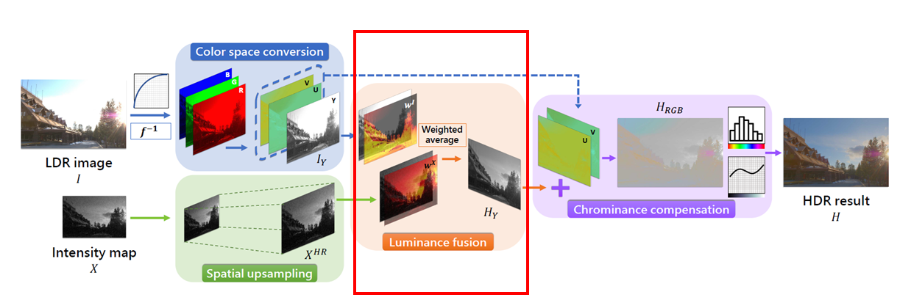

+ 以上是流程图，具体的步骤如下
    + 首先我们利用相机响应函数将 *LDR* 的图片从非线性转化到线性空间得到图片*pic1*
    + 将 *pic1* 从 *RGB* 空间转换到 *YUV* 空间中得到 *pic2*，此时 *Y* 平面中包含了图象的深度信息
    + 将 *intensity map* 过采样到和 *LDR* 图片大小相同得到 *pic3*
    + 将 *pic3* 和 *pic2* 的 *Y* 平面进行融合得到 *pic4*
    + 将 *pic4* 作为 *pic2* 的 *Y* 平面，将其转化为 *RGB* 空间
    + 最后通过 *tone mapping* 将图片转化为观感较好的 *RGB* 图片


#### 2.3 具体的实现与效果展示

+ 使用 *opencv* 的 *python* 版本实现
+ 具体使用到的库以及 *python* 的版本信息如下

```txt
python: 3.7.9 [MSC v.1916 64 bit (AMD64)]
matplotlib: 3.3.2
numpy: 1.19.1
cv2: 4.4.0
```

+ 每一步的实现如下，具体细节见代码

+ 以下以示例图片作为简单的效果展示

+ 示例图片

    + *ldr* 图片

        

    + *intensity map*

        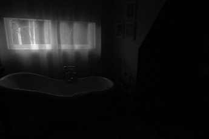

    + *ground truth*

        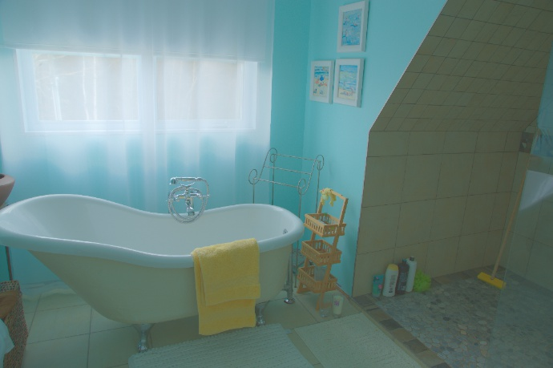

##### (1) 逆色调映射

+ 因为我们不知道相机的响应函数以及图片的曝光时间，因此使用简单的 *gamma2.2* 校正
    + $y=x^\frac{1}{\gamma},gamma=2.2$
+ 效果图如下


##### (2) *RGB* 空间转换为 *YUV* 空间

```python
# opencv 自带的函数
cv2.cvtColor(ldr_linear, cv2.COLOR_BGR2YUV)
```

+ 展示 *YUV* 空间的图片

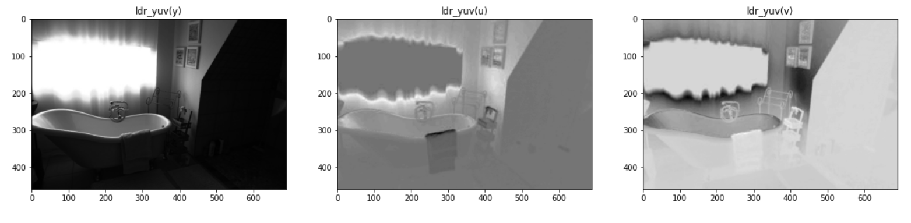

+ 我们看到这里的 *Y* 平面中确实含有一定的深度信息

##### (3) *intensity map* 的大小转换

+ 使用论文中给的使用 *INTER_CUBIC* 三次样条插值


##### (4) 深度融合

+ 尝试了两种融合方法

    + 论文中给的是 $w_{ij}∗Y_{ij}+(1-w_i)∗I_{ij}$
        + 其中

    $$
    w_{ij}=\frac{(0.5-max(|I_{ij}-0.5|,τ-0.5))}{(1-τ)}
    $$

    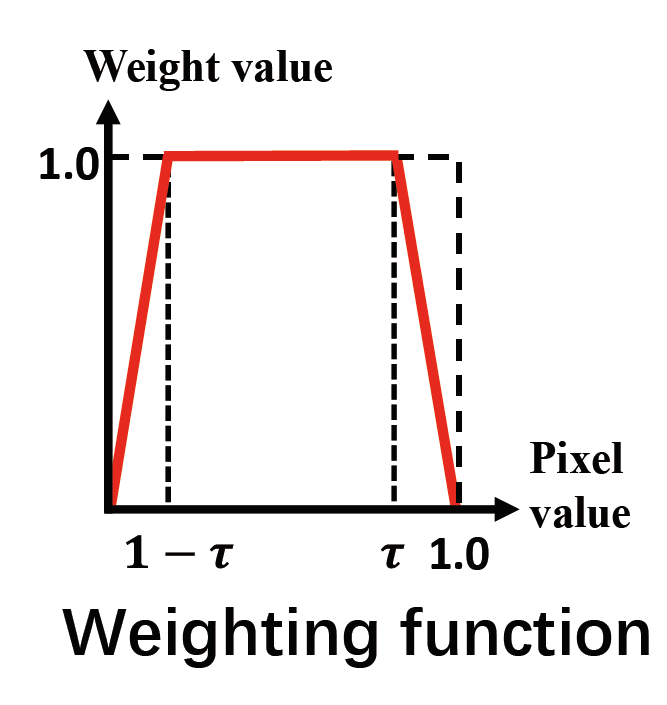

    + $w_{ij}∗Y_{ij}+I_{ij}$

+ 展示效果图如下

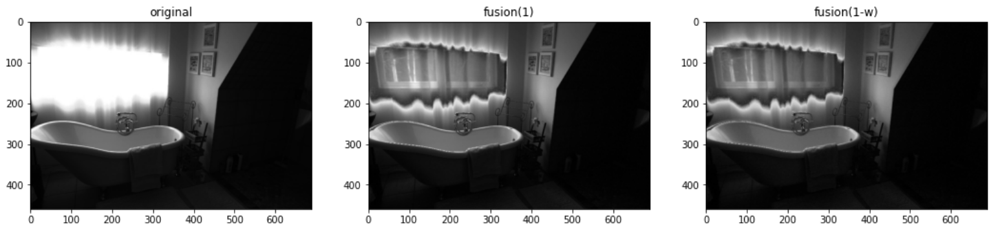

##### (5) 最后的色调映射

+ 简单的使用 *gamma2.2* 校正

+ 效果展示

    + 使用论文函数 (*w*)

    

    + 使用函数 (*1-w*)

    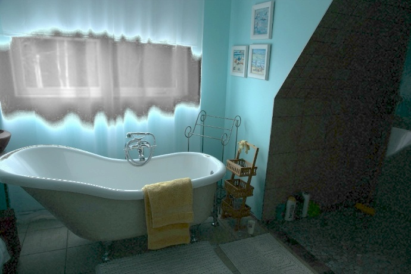

+ 图上我们可以看到亮处的深度信息已经被恢复出来，但是颜色信息缺失了

+ 上下对比，我们发现使用函数 *w* 的图片更加亮一些，但是出现了一些模糊的现象（例如水管部分）

    + 更亮是因为使用 *w* 得到的值更大
    + 模糊是因为 *ldr* 图片和 *intensity map* 的对齐问题，对齐问题在两张图的深度都占一定比例时体现的最完全，也就是亮度中等的时候

+ 颜色信息缺失是没有办法的，因为我们没有处理原图的 *U/V* 两个平面的颜色信息，而只是补充上了深度信息

+ 而论文中最后使用神经网络生成的图像从 *U/V* 两个平面学到了色彩信息，因此填充上了色彩

+ 还有存在的问题是过渡效果比较差，因为 *intensity map* 中整体偏暗，导致结果图中本应该是亮色的部分反而偏暗，因此过渡比较难看


#### 2.4 一些改进与颜色校正的尝试

+ 在上课做完报告之后，我们发现在 *intensity map* 之中确实整体偏暗，导致合成的结果亮色部分偏暗，以下是我们的一些修改策略
+ 以下以示例图片为例，展示如下

##### (1) 直方图均衡化 (调库+256采样)

+ 原始的直方图

    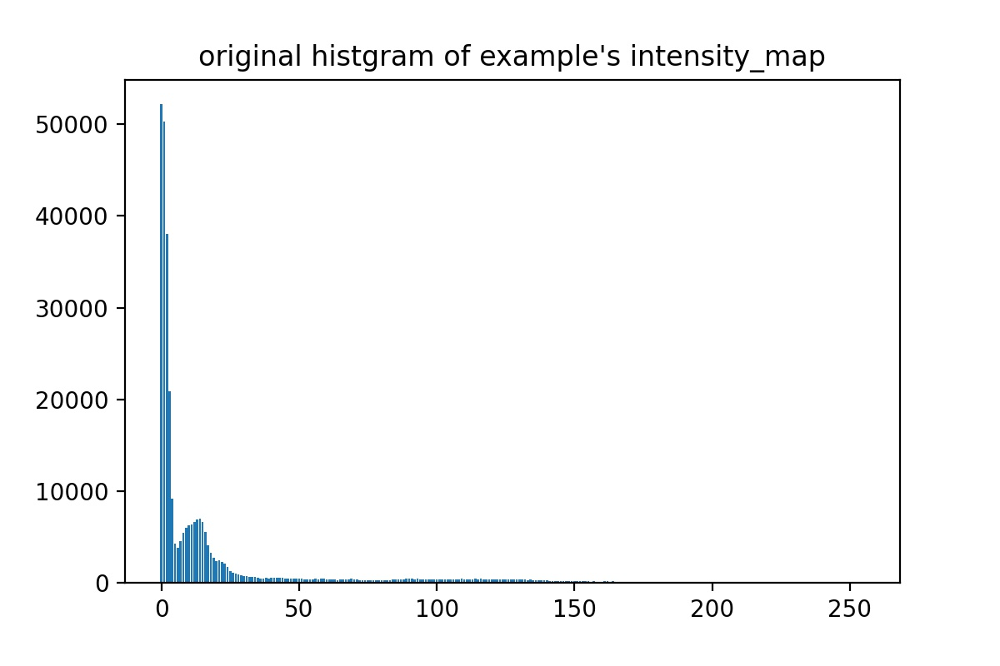

+ 直接调用内置的函数实现，但是内置的函数只能实现 *256* 精度的采样

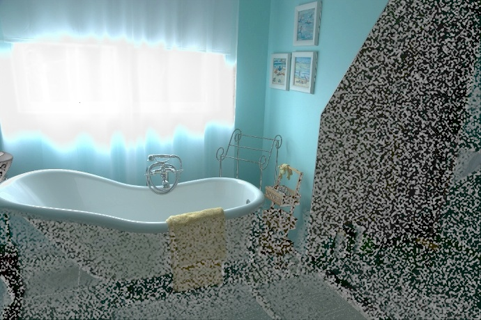

+ 效果如上图所示，我们发现亮色部分的提升很明显，但是暗色部分的噪声也很明显

    + 这一方面是时直方图均衡化采样精度低导致的问题

        + 采样精度低会导致结果并不是很均衡，丧失高动态范围

    + 另一方面是原生的问题 *intensity map* 本来分辨率就低导致的

    + 均衡化的直方图如下

        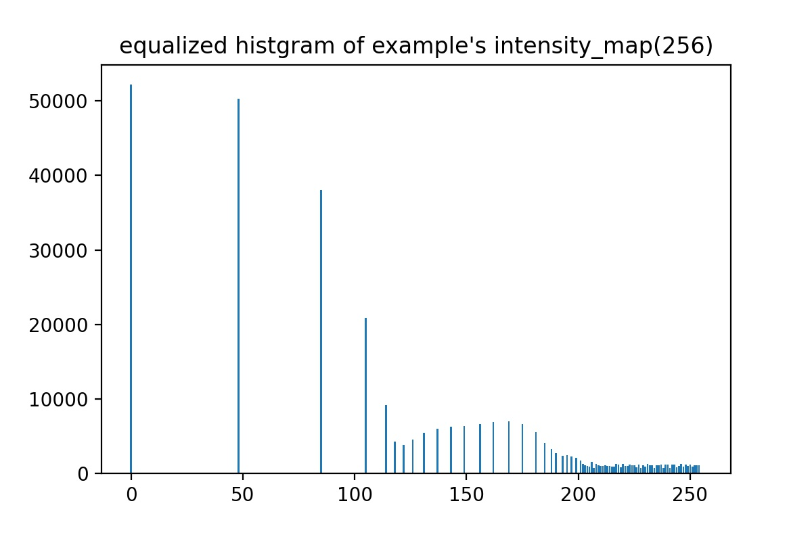

##### (2) 直方图均衡化 (高采样)

+ 自己写的一个高精度的直方图均衡化

+ 采样精度为 *10000*，直方图如下

    + 基本上实现了均衡化

    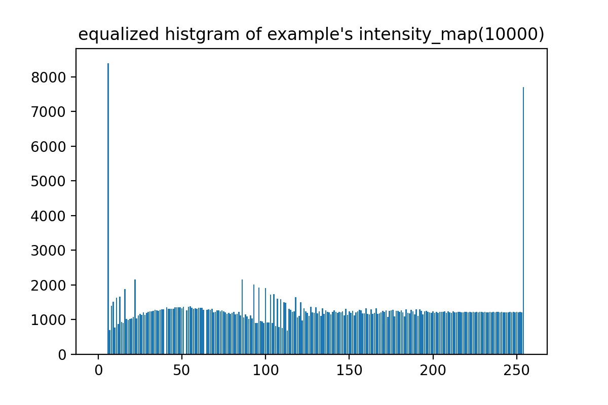

+ 但是最终合成效果还是不太好，噪声很严重（似乎更严重了，噪声的采样也更细致了）

    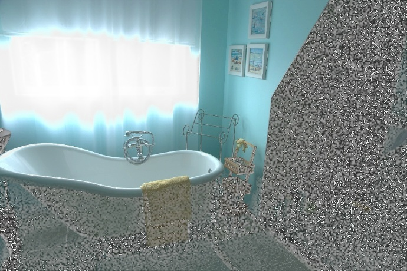


##### (3) 调整权重函数

+ 手动设置范围将暗部噪声减弱

+ 一个简单的操作就是直接将暗处的 *intensity map* 舍去，将权重函数修改为如下
    $$
    w_{ij}=\frac{(0.5-max(I_{ij}-0.5,τ-0.5))}{(1-τ)}
    $$
    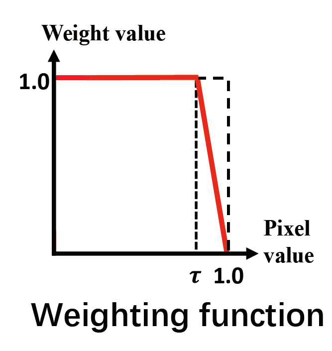

+ 虽然说这样就舍弃了暗部的高动态范围，但是这和噪声相比不算什么

+ 效果如下

    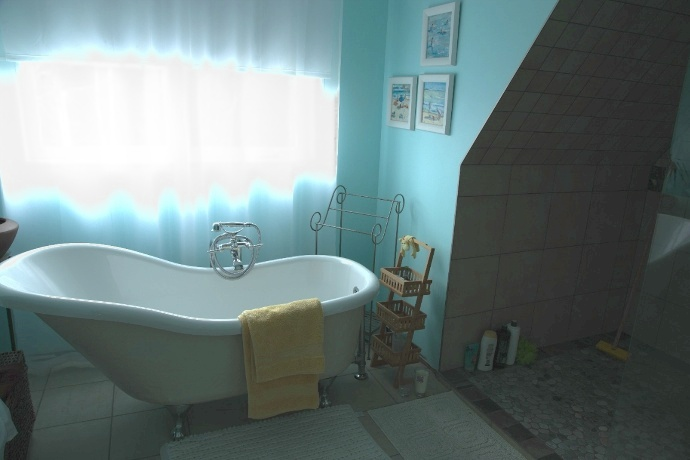

+ 感觉还是很棒的，过度效果也挺好的


#### 2.5 其他图片的效果图

```c
// TODO
```

+ 上面的处理方法对于不同的图片效果差异还是比较大的，具体的图片在 [文件夹](materials/paper2) 中，这里只是简单展示


##### (1) 图片1的结果

+ 效果很好，过渡比原来直接做的效果好太多了
+ 不使用 *intensity map* 的暗部也使得噪声控制很好

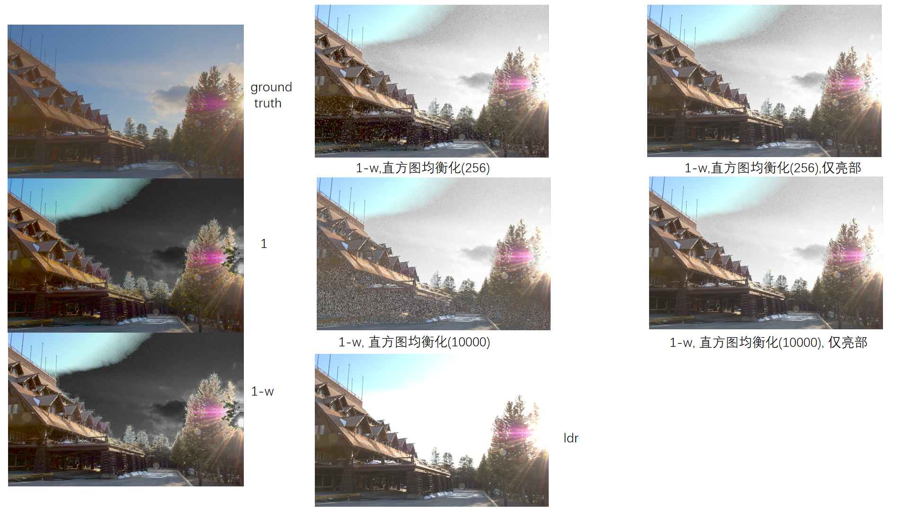


##### (2) 图片2的结果

+ 效果一般，但是色调比较正常
+ 过渡也比较好，但是跟 *ldr* 图片相比，最终的动态范围提升不大
    + 这张图片的主要提升点应该在暗部，但是我们现在的解决方案对暗部提升没有作用

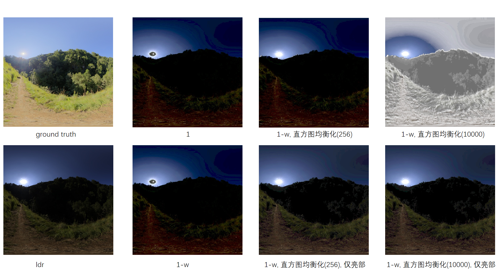

+ 尝试了一个其他的方法

    + 对整体进行一个校正，暗处加强，亮处减弱
        $$
        s=T(r)=\frac{(2x-1)^{\alpha}+1}{2}
        $$


    + 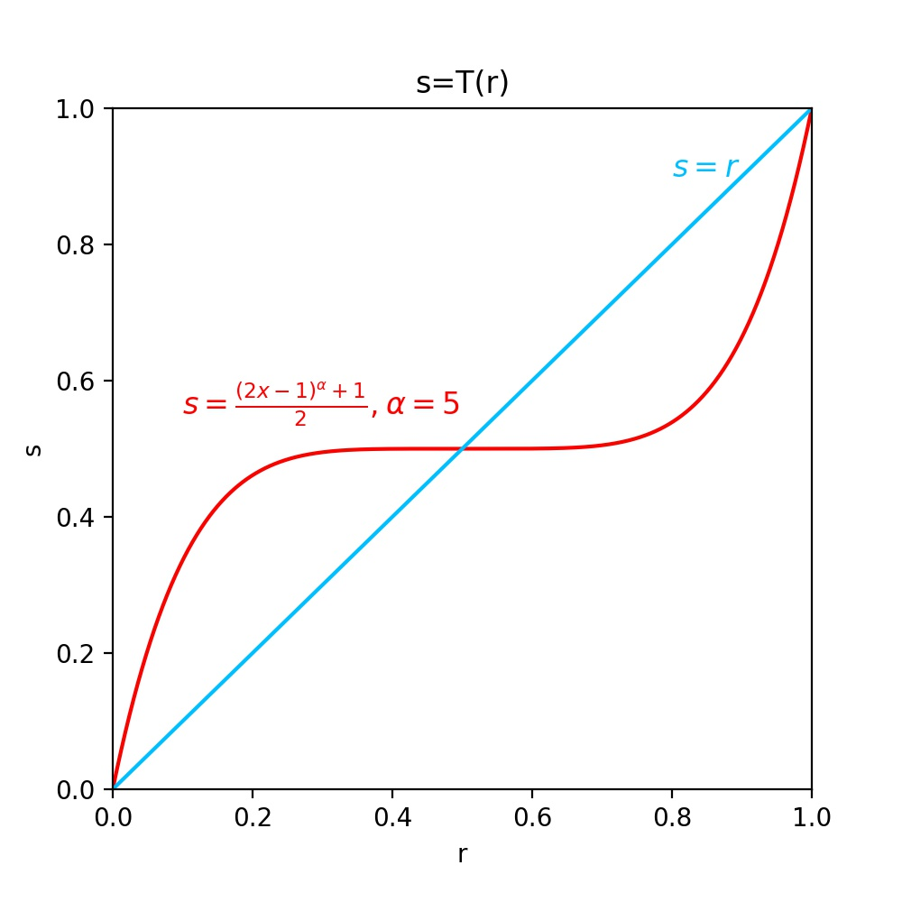

    + 使用 *1-w*，仅保留 *intensity map* 中的亮部

    + 效果如下

        + 相较于之前而言，整体配色接近原始图片，而且在亮处的过度也稍微好一些，此时暗处提确实提高了亮度

        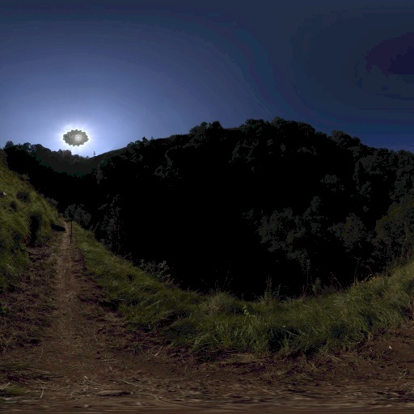

#### 2.6 代码执行

+ 进入文件夹 *"materials/paper2"* 执行代码 *"main.py"* 即可
+ [README](materials/paper2/README.md)


### 论文 *3*：对单张 *LDR* 图片，利用 *deep-CNNs* 重建 *HDR* 图片

> *HDR image reconstruction from a single exposure using deep CNNs*

#### 3.1 环境配置

+ 实验环境 *Google Colab*

```txt
tensorflow-gpu==1.12.0
tensorlayer==1.11.0
OpenEXR-1.3.2
```

+ 遇到一些问题
    + 本地配置可能需要比较大的显存
        + 至少大于 *2G*
    + 对于比较大的图片上的输入，可能也跑不动

#### 3.2 方法简述

+ 构造一个神经网络如下，训练从一张图片生成 *HDR* 的能力

    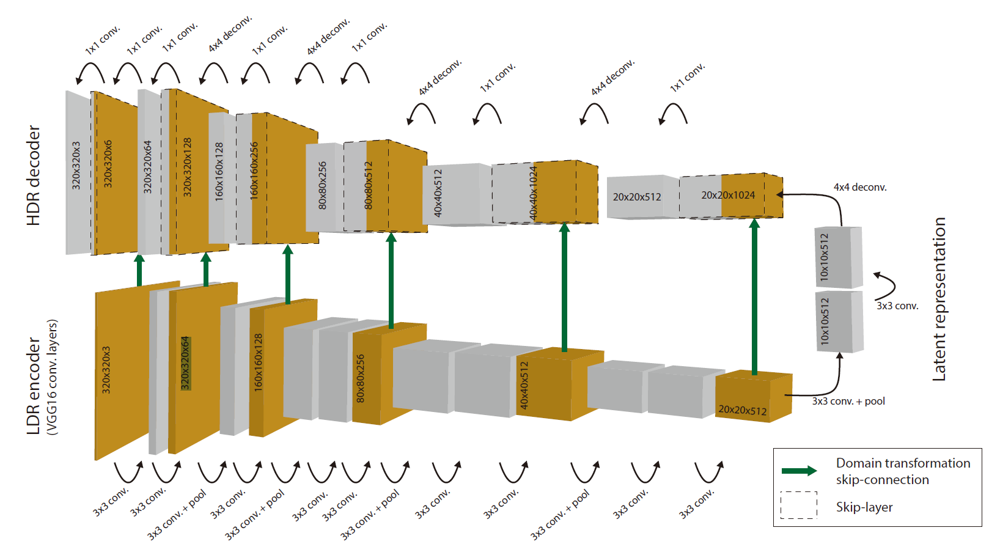


+ 设计亮点
    + *skip-connection*
        + 保留高维细节
    + *HDR-decoder* 对比
        + *log* 域
        + 范围大
    + 损失函数
        + 直接差异*R* + 正则项 *I*
        + 颜色，细节 + 全局亮度
        + *I* => 只能处理高曝光的补全
        + 只能够补全高曝光面积较小的区域
+ 本质上神经网络是学习到了加强高曝光区域的细节
    + 如果输入的图片在高曝光区域没有任何细节，那么是无法恢复的

#### 3.3 效果展示

##### (1) 示例图片

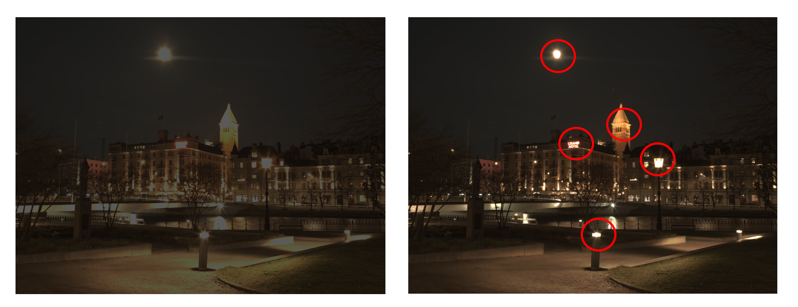

+ 效果很好，甚至文字细节都展示出来了


##### (2) 论文 *1* 的图片

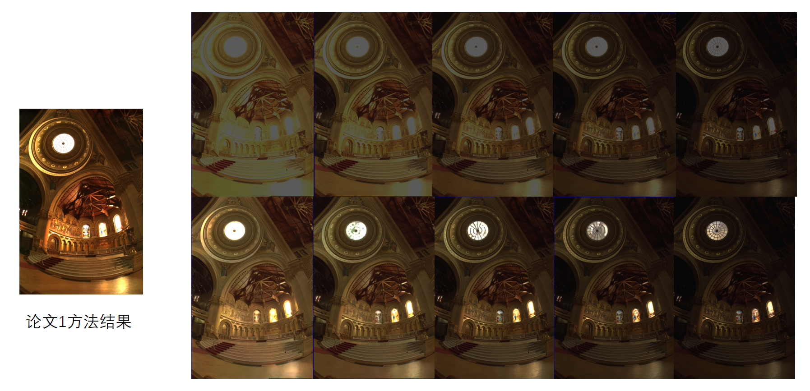

+ 效果超级好
+ 灯顶、窗户细节


##### (2) 论文 *2* 的图片

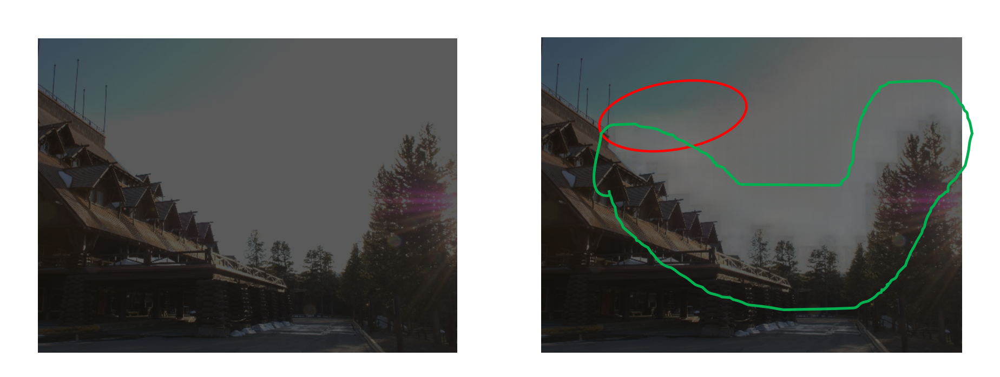

+ 首先恢复了一些颜色信息，这是论文 *2* 的简单方法做不到的，这个很强
    + 红色区域
+ 出现了一些问题，树枝周围存在一些阴影
    + 绿色区域
    + 神经网络本质上是加强了高曝光区域的细节，这里细节信息比较少，因此将树枝周围的小的高曝光区域使用树枝的成分进行了补全，导致在结果上产生了阴影

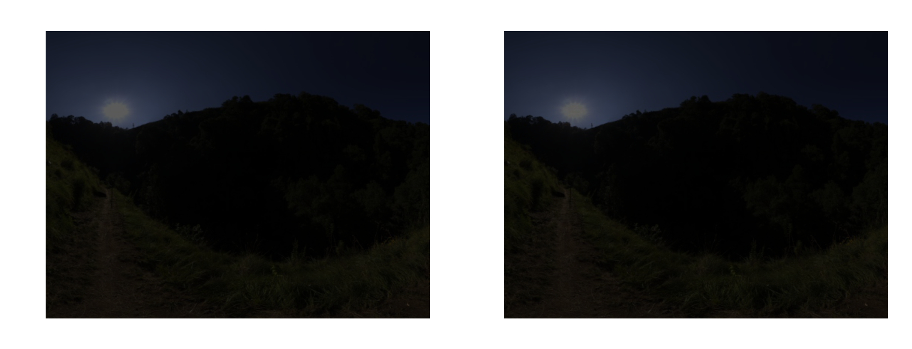

+ 对于低曝光区域，神经网络无法给出结果

##### (3) 自己拍的照片

+ 灯光

    + 能够很好的将灯光细节恢复过来

    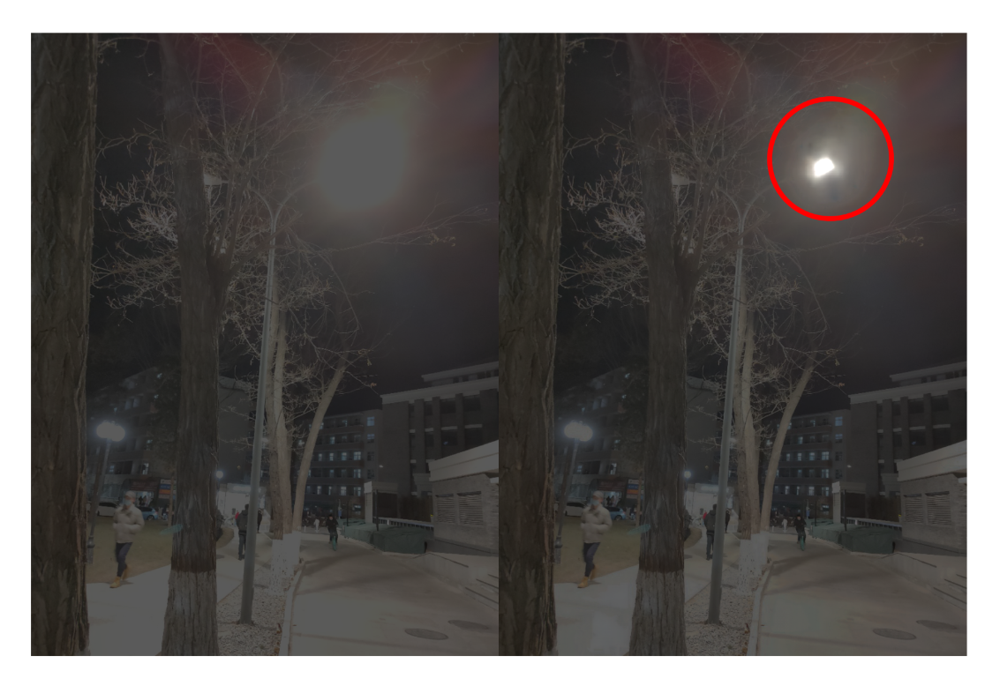

+ 安全入口标志

    + 也能除去一些发光的亮晕
    + 对于上面的灯，也有一定的缩小光电的作用

    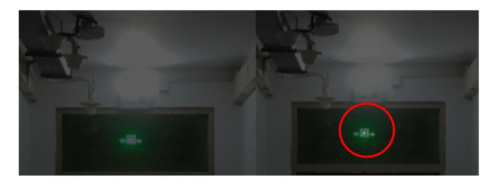

+ 中文字

    + 恢复没有英文字那么明显，可能是中文字符的连接比较复杂，没有英文字符那么容易修复

    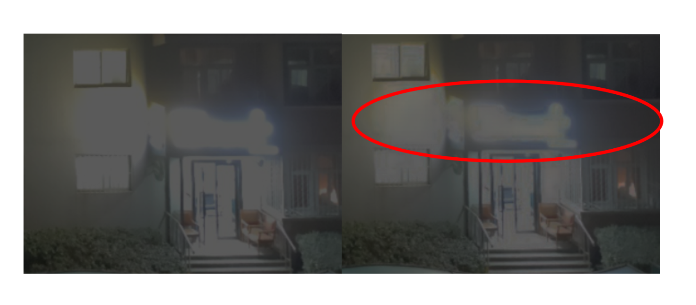


## 三. 总结

### (1) 方法对比

+ 论文 *1*：利用多张不同曝光时间的图片重建 *HDR* 图片
    + 优点
        + 理论基础好，图片较多时恢复效果好
        + 能够把高曝光和低曝光区域的高动态范围都做的很好
    + 缺点
        + 需要大量已知曝光时间的照片
        + 需要自己设定最终的色调映射函数
            + 设置不好的时候会出现奇怪的色彩
        + 多张图片需要处理对齐的问题
+ 论文 *2*：利用单张 *LDR* 图片和 *intensity map* 图片重建 *HDR* 图片
    + 优点
        + 能够将图像的深度信息较好的恢复
        + 两张照片即可，相对容易获取
    + 缺点
        + 需要获得 *intensity map*
        + 恢复不出来颜色信息
        + 需要自己设置色调映射函数
        + 可能需要进行 *ldr* 图片和 *intensity map* 的对齐
            + 存在一定的偏差
        + 每一张图片的性质不同，如果要恢复得比较好的话，需要对每一张图片进行调节
        + *intensity map* 的低分辨率导致图片的低曝光区域噪声很多，因此对低曝光区域的恢复也不太好
+ 论文 *3*：对单张 *LDR* 图片，利用 *deep-CNNs* 重建 *HDR* 图片
    + 优点
        + 所需材料少，获取材料简单
        + 效果其实很好，使用论文*1* 中一张合适的图片便可以将整体恢复得很好
    + 缺点
        + 训练一个这样的神经网络需要大量的材料和算力
        + 需要有一定的硬件设备
            + 显卡内存需要比较大
        + 只能恢复高曝光饱和的情况
        + 细节缺失严重的时候恢复不出来
        + 回复的细节信息可能与实际有所偏差